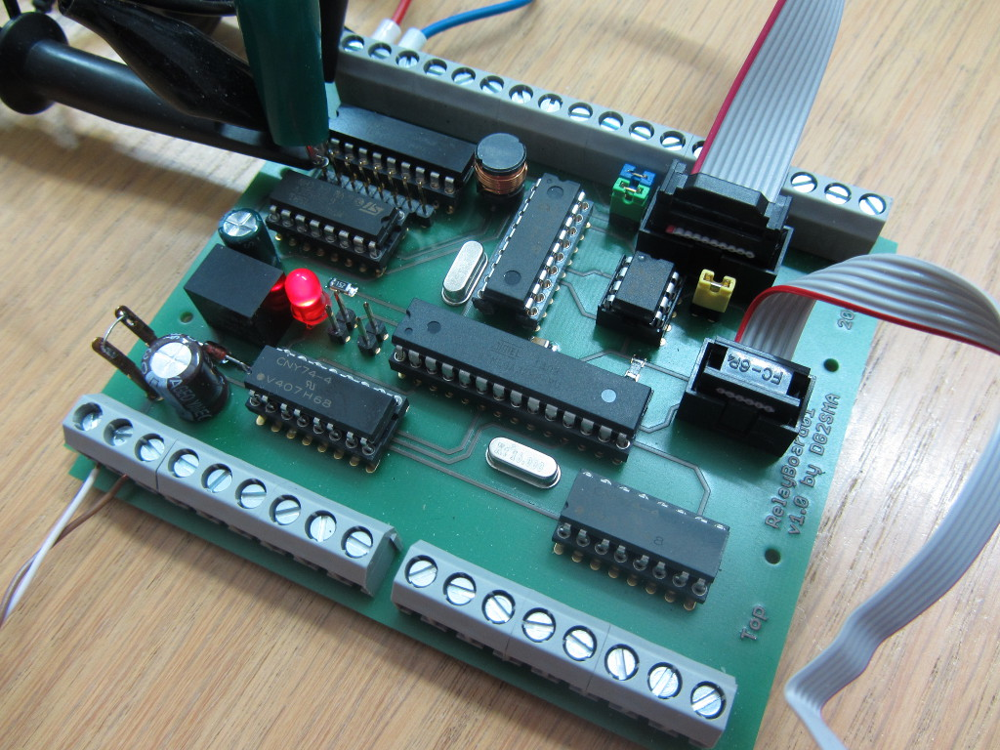
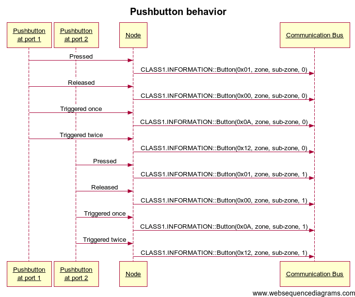
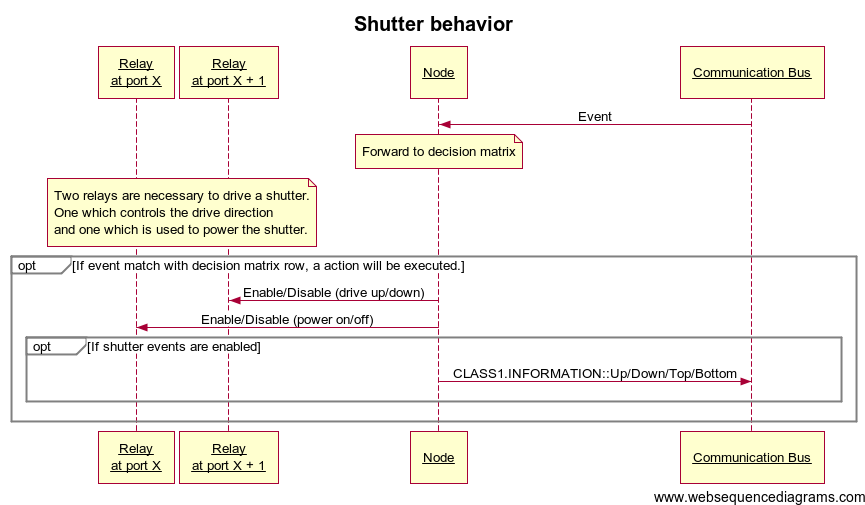

# Relay Board 01

## Description

* Controls up to 8 external relays (mono stable).
* Controls up to 4 shutters (per shutter two relays are used).
* Connect up to 8 pushbuttons.
* Connect a wind gauge to measure the wind speed and protect the shutters.
* The pcb will be mounted in a closed din-rail housing. Dimension: 100 mm x 86 mm
* Every relay is controlled by a PWM and differs between the duty cycle to switch a relay and the duty cycle to hold a relay switched.
* Monitoring:
  * The scheduler is monitored by internal watchdog.
  * The CAN bus is monitored.

## Behavior

### Pushbuttons

### Relays

### Shutters

## AVR Fuses

* Brown-out detection set to 4,3V
* Serial program downloading enabled
* Boot sector size set to 4096 bytes (2048 words)
* 16 MHz crystal oscillator

This will result in
* Without bootloader: Extended 0xFC, High 0xD9, Low 0xFF
* With bootloader: Extended 0xFC, High 0xD8, Low 0xFF

## Mailing list

Are you interesting? Join us on the mailing list: https://groups.google.com/forum/#!forum/vscp

## Issues, Ideas and bugs

If you have further ideas or you found some bugs, great! Create a [issue](https://github.com/BlueAndi/vscp-framework/issues) or if
you are able and willing to fix it by yourself, clone the repository and create a pull request.

## License
The whole source code is published under the [MIT license](http://choosealicense.com/licenses/mit/).
